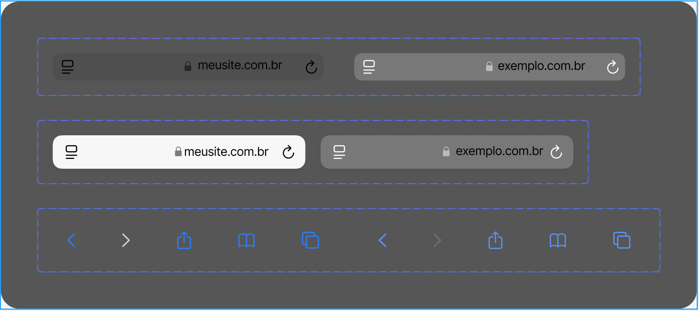

# Criando o seu Primeiro Design System

## Descrição do Projeto

Este projeto faz parte do desafio de Formação UX Designer, cujo objetivo é criar um Design System para garantir a consistência visual e funcional em uma interface de usuário (UI). O projeto inclui a criação de componentes reutilizáveis como botões, barras de navegação, tipografia e paletas de cores, que podem ser aplicados de forma uniforme em diversas interfaces.

## Objetivo do Desafio

O objetivo principal foi criar um sistema de design que demonstra:

- A padronização de componentes visuais.
- Definição de cores, tipografia e espaçamentos.
- Uso de elementos reutilizáveis como botões, ícones e campos de input.
  
Este Design System serve como base para futuras implementações e refinamentos de interfaces, promovendo consistência e eficiência no desenvolvimento de UI.

## Tecnologias Utilizadas

- **Figma**: A ferramenta utilizada para a criação do wireframe.
- **Markdown**: Para documentação e descrição do projeto.

## Estrutura do Projeto

- **Barra_Localização.fig**: Arquivo nativo do Figma que contém o Design System desenvolvido.
- **Barra_Localização.pdf**: Exportação em PDF do Design System para fácil visualização e compartilhamento.
- **Barra_de_Localizacao.PNG**: Imagem representativa do Design System.

### Prévia do Design System

## Instruções para Visualização

1. Para visualizar e editar o Design System diretamente no Figma, utilize o arquivo Design_System_Template.fig. Importe-o no Figma, caso necessário.
2. Para uma visualização rápida, abra o arquivo Design_System_Template.pdf, que contém uma versão exportada do Design System.
3. A imagem DesignSystemTemplate.PNG também oferece uma prévia do sistema.

## Considerações Finais

Este Design System oferece uma fundação sólida para o desenvolvimento de interfaces de usuário consistentes e escaláveis. Ele pode ser expandido e adaptado para diferentes projetos, promovendo uma experiência visual e funcional unificada.
